# BM83_GETTING_STARTED

> “Wireless Made Easy!" - BM83 Getting Started with Embedded and Host modes with Multi-speaker (MSPK) Firmware

**The BM83 is a fully-certified Bluetooth 5.0 dual-mode audio module (Bluetooth Classic and BLE) with embedded DSP (AAC/SBC support along advanced audio and voice processing - WB speech, AEC  and Noise Reduction)**
**This guide demonstrates first the Embedded mode (BM83 as a standalone device) and then the Host mode (BM83 + PIC32MX450F256L, dual chip to unleash performance).**
**This solution integrates the Multi-speaker (MSPK) Firmware, an all-in-one Firmware, that covers Mono/Stereo and more than 2 speakers configuration.**

<a href="https://www.microchip.com" target="_blank">
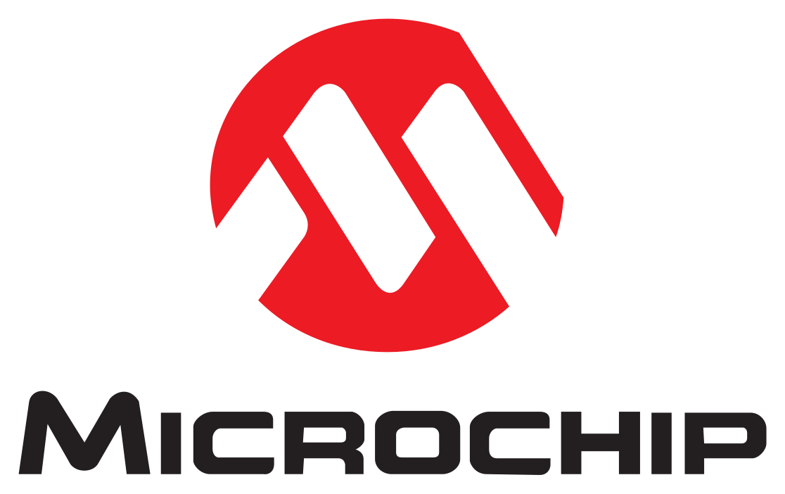
</a>
&nbsp;&nbsp;&nbsp;&nbsp;&nbsp;&nbsp;&nbsp
<a href="https://www.microchip.com/bm83" target="_blank">
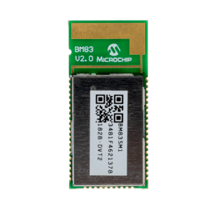
</a>
&nbsp;&nbsp;&nbsp;&nbsp;&nbsp;&nbsp;&nbsp
<a href="https://www.microchip.com/wwwproducts/en/PIC32MX450F256L" target="_blank">
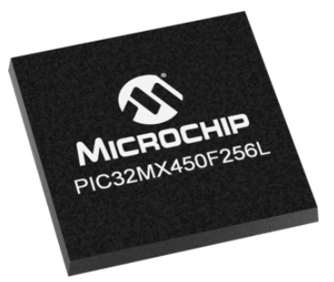
</a>

<a href="https://www.microchip.com/bm83" target="_blank">https://www.microchip.com/bm83</a>
&nbsp;&nbsp;&nbsp;&nbsp;&nbsp;&nbsp;&nbsp
<a href="https://www.microchip.com/wwwproducts/en/PIC32MX450F256L" target="_blank">https://www.microchip.com/wwwproducts/en/PIC32MX450F256L</a>

1. [Discover our Technologies](#step1)

	1. [Introduction to BM83](#step1a)
	1. [Radio Performance](#step1b)
    1. [Multi-speaker Configuration](#step1c)
	1. [Embedded or Host Mode](#step1d)
	1. [Internal or External Codec](#step1e)
	1. [LDAC Support](#step1f)
1. [Overview of our Solutions](#step2)
    1. [Select a speaker](#step2a)
	1. [Smartphone Apps](#step2b)
	1. [Reference Design](#step2c)
	1. [Evaluate Stereo Mode](#step2d)
	1. [Evaluate Multi-speaker Mode](#step2e)
	
1. [Select the device you need](#step3)
1. [Develop with BM83](#step4)
    1. [... and PIC32MX450F256L in Host mode](#step4a)
	2. [... and no external MCU in Embedded mode](#step4b)
1. [Additional ressources](#step5)

## Discover our Technologies 

### Introduction to BM83 

The BM83 is certified Bluetooth 5.0 dual-mode module.
- Bluetooth Classic: BDR/EDR low-level transport layer for audio or voice streaming and SPP for data exchange (provisioning).
- BLE transport for proprietary transparent service to provide a BLE substitute for the Serial Port Protocol (SPP) of classic Bluetooth for use with an Apple® iPhone®, which does not support SPP 
(audio commands for working with Android and iOS).
 

**About Bluetooth Audio Technology:**
- Highly popular technology found everywhere including smartphone, consumer and professional products along IoT
- It refers to 2 technologies
    - Bluetooth Classic : focus on continuously streaming data. Typical use case is Audio with a specific Bluetooth Audio profile called A2DP
    - Bluetooth Low Energy (BLE) : focus on sending bulks of data while optimizing power consumption. Highly popular in IoT
- Key things to know about Bluetooth Classic (… and Audio)
    - It takes more than Bluetooth to support Audio : audio products typically are dual mode bluetooth (Classic + BLE) with embedded MCU and DSP for audio processing. This is what Microchip proposes !
    - A2DP profile could support different music codecs to compress the music files into bit-rates that could then be broadcasted thru Bluetooth
    - Popular codecs :  low-complexity sub-band codec (SBC), Advanced audio coding (AAC), Sony’s proprietary codecs (LDAC)
    - Microchip has BM83 solutions decoding SBC, AAC and has IS2083BM-2L2 solution decoding LDAC.
    - Microchip has solutions for Stereo and Multi speakers, True Wireless earbuds, headsets and headphones
 

### Radio Performance 

Two Power Amplifiers are integrated into the BM83 device:
- The Medium Power Amplifier (MPA) supports up to +9.5 dBm (typical) output power for Bluetooth Class 1 applications (higher range around 100 meters), well suited for multi speaker applications 
- The Low Power Amplifier (LPA) supports up to +0.5 dBm (typical) output power for Bluetooth Class 2 applications (headset or mono/stereo speaker)

The user can select either one depending on his use case.
 

### Multi-speaker Configuration 

The BM83 module comes with the Multi-speaker (MSPK) Firmware that covers both configurations: 
- MSPK Firmmare enables A2DP music streaming to one speaker (mono) or two speakers (stereo: mono left and mono right).
- MSPK Firmware enables A2DP music streaming to more than two speakers from one audio source such as a smartphone.
MSPK refers also to Microchip Wireless Concert Technology (WCT).
 

<a href="http://www.microchip.com//wwwAppNotes/AppNotes.aspx?appnote=en611934" target="_blank">AN3118 - IS2083 Bluetooth Audio Application Design Guide</a>

### Embedded or Host Mode 

- Host mode:
    - Interfaces with an external PIC32MX450F256L MCU over UART for application specific system control
    - The PIC32 MCU can control the BM83 through UART command set
	- For faster time to market, we recommend to use PIC32 MCU leaveraging the reference design provided by Microchip Technology
	- MSPK solution can reside on PIC32 MCU
- Embedded mode:
    - No external MCU involved
	- MSPK Firmware is embedded into BM83
    - BM83 acts as a standalone device to control a set of Input/Ouputs along the speaker features.
    Simple system control can be implemented in the module MCU by using the Configuration GUI Tool (IS208x_Config_GUI_Tool vxxx).
    DSP parameters such as equalizer settings can be set using the Config GUI Tool

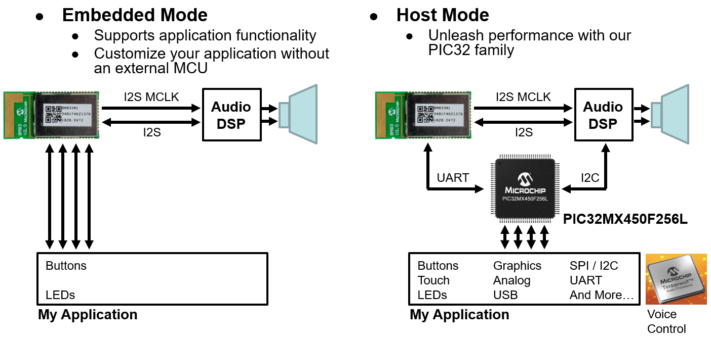

### Internal or External Codec 

The BM83 has a built-in codec. If power requirement of the speaker is < 5W then internal codec may be used. 
  Internal codec provides analog output to connect directly a speaker.
 
For high power speaker, an external class D amplifier if required. External codec interface is through I2S.
 

BM83 offers a flexible approach for codec interface:
- In Embedded Mode (no external MCU is required)
   - Internal codec selected (in the GUI Tool), analog output is enabled
   - External codec in I2S is selected (in the GUI Tool), the turnkey firmware supports only the STA369BW codec
- In Host Mode (external MCU acting has a Host for the BM83)
   - Internal codec selected (in the GUI Tool), analog output is enabled
   - External codec in I2S is selected (in the GUI Tool), you can connect the STA369BW codec or implement any codec and add the corresponding driver in the Host MCU Application code

### LDAC Support 

Using LDAC requires to obtain a license from Sony. 
https://www.sony.net/Products/LDAC/

LDAC is supported by default in the IS2083 Turnkey firmware available <a href="http://ww1.microchip.com/downloads/en/DeviceDoc/IS2083%20Software%20&%20Tools%20(v1.0.3).zip" target="_blank">here</a> 
See the details, page 22 of the <a href="http://www.microchip.com//wwwAppNotes/AppNotes.aspx?appnote=en611934" target="_blank">AppNote AN3118</a> 
(Note: By default, LDAC functionality is enabled in the firmware but supported only on IS2083BM-2L2 device) 

LDAC requires a specific hardware: IS2083BM-2L2. 
See the details page 9 and 10 in the <a href="http://ww1.microchip.com/downloads/en/DeviceDoc/IS2083-Bluetooth-Stereo-Audio-SoC-Data-Sheet-DS70005403B.pdf" target="_blank">IS2083 Datasheet</a> to check the hardware difference 

To summarize, same Turnkey Firmware for LDAC or non-LDAC usage but different hardware.

## Overview of our Solutions 

### Select a speaker 

To evaluate our Bluetooth audio solutions, we've compiled a list of possible speakers compatible with BM64 Evaluation Board.

-> **Good, compact speaker for High Resolution demo:**
<ul>
<li>
Bose Companion 20:
<a href="https://www.bose.com/en_us/products/speakers/stereo_speakers/companion-20-multimedia-speaker-system.html" target="_blank">
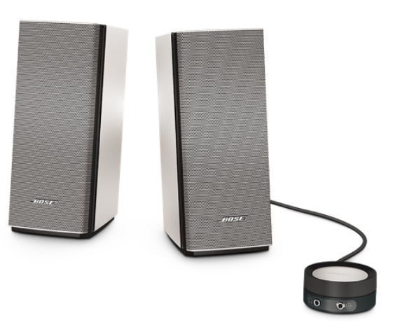
</a>
</li>
 

<li>
Eltax MONITOR I: 
<a href="https://www.eltax.com/compactspeakers?lang=en" target="_blank">
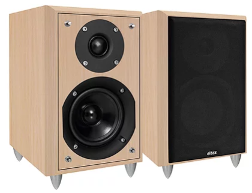
</a>
</li>
 

<li>
KRK RP6G3:
<a href="http://www.krksys.com/ROKIT-Powered-G3-Studio-Monitors" target="_blank">
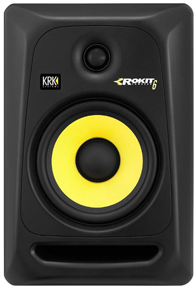
</a>
</li>
</ul>
 

-> **Simple, light and small speakers for our BM83 EVB demo (not High Resolution):**
    Ideal for mobility and demonstration purpose.
<ul>
<li>
Small 5W speakers from AliExpress:
<a href="https://fr.aliexpress.com/item/32813633947.html?spm=2114.10010108.1000014.1.5adf217dwLUEud&gps-id=pcDetailBottomMoreOtherSeller&scm=1007.13338.110449.000000000000000&scm_id=1007.13338.110449.000000000000000&scm-url=1007.13338.110449.000000000000000&pvid=fdd97866-236d-4ba5-9397-6af4f1ebfbce" target="_blank">
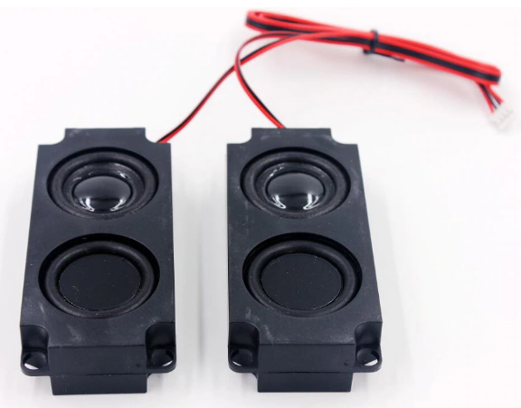
</a>
</li>
</ul>
 

### Smartphone Apps 

Microchip provides a smartphone App called MBA (Microchip Bluetooth Audio) supporting both Android 6.0 (or higher) and iOS 10.0 (and higher device).
 
Mobile Application discovers BLE devices and filters the Microchip Audio devices (BM6x or BM8x based) and communicates with them over Microchip’s Proprietary BLE Service called Transparent Service.
This Mobile Application can be used for Stereo (DSPK) or Multi-speaker (MSPK) audio applications.
 
MBA is available as code sources and as an App in the respective stores.
- The source code of the App for Android and iOS are available to download and both come come along with MSPK2v1.2 Software Package (located into "Software\Source Code" folder):
<a href="https://ww1.microchip.com/downloads/en/DeviceDoc/IS2083_Turnkey_1.2.0.zip" target="_blank">https://ww1.microchip.com/downloads/en/DeviceDoc/IS2083_Turnkey_1.2.0.zip</a>
- The Android version of the MBA app is available from the Google Play™ store:
<a href="https://play.google.com/store/apps/details?id=com.app.microchip.audiowidget&hl=en" target="_blank">https://play.google.com/store/apps/details?id=com.app.microchip.audiowidget&hl=en</a>
- The iOS version is available in the iTunes® store:
<a href="https://apps.apple.com/us/app/microchip-bluetooth-audio/id1309473719" target="_blank">https://apps.apple.com/us/app/microchip-bluetooth-audio/id1309473719</a>

### Reference Design 

**The BM83 Evaluation board is a Reference Design that matters to get started with Bluetooth Audio.** 
BM83 Evaluation board: <a href="https://www.microchip.com/DevelopmentTools/ProductDetails/PartNO/DM164152" target="_blank">DM164152</a>
 

Kit contains: 
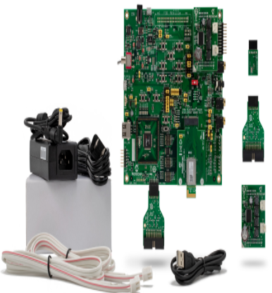

The BM83 Bluetooth Audio Development Board (BM83 EVB) enables the user to evaluate and demonstrate the functionality of the BM83 audio module in Host or Embedded mode:
- The BM83 EVB features an on-board PIC32MX450F256L for Host MCU mode applications, an external codec to improve audio quality, a digital microphone to capture voice audio, indicator LEDs and buttons for ease of development.
The PIC32 MCU is connected to the BM83 module over UART. The host MCU is controlling the BM83 module and driving the I2S audio out from the BM83 to an STA369BW Audio Daughter Board.
- The BM83 EVB supports also the Embedded mode configuration. In this mode of operation, the BM83 module is driving the I2S audio out to the STA369BW Audio Daughter Board. 
The BM83 module is connected to the external codec over I2S and I2C.

By default, the BM83 EVB comes configured in Embedded Mode.

<a href="http://ww1.microchip.com/downloads/en/DeviceDoc/BM83_Bluetooth_Audio_Development_Board_User_Guide-DS50002902A.pdf" target="_blank">BM83 EVB User Guide</a>
 

Follow the <a href="http://ww1.microchip.com/downloads/en/DeviceDoc/SCH_BM83_Reference_Circuit_Embedded_Mode_v1.0.pdf" target="_blank">BM83 Reference Circuit</a> if you look specifically for Embedded Mode schematics.

### Evaluate Host Mode

<a href="http://ww1.microchip.com/downloads/en/DeviceDoc/BM83_Bluetooth_Audio_Development_Board_User_Guide-DS50002902A.pdf" target="_blank">BM83 Bluetooth Audio Development Board User Guide</a> introduces the kit features, gives you guidelines to setup a quick demo to stream audio using the BM83 module in Embedded mode.
 

**This demo is based on MSPK 2.0 Firmware and requires some customization and some hardware changes. The Host Mode has to be selected from the Config Tool. That simply enable BM83 UART.**
**The host MCU (on-board PIC32 MCU) is connected to the BM83 module over UART. The host MCU is controlling the BM83 module and driving the I2S audio out from the BM83 to an STA369BW Audio Daughter Board.**
**Follow the instruction from the BM83 Bluetooth Audio Development Board User Guide**
 
Resources: 
- <a href="http://ww1.microchip.com/downloads/en/DeviceDoc/BM83_Bluetooth_Audio_Development_Board_User_Guide-DS50002902A.pdf">BM83 Bluetooth Audio Development Board User Guide</a>
- <a href="http://ww1.microchip.com/downloads/en/DeviceDoc/IS2083%20Software%20&%20Tools%20(v1.0.3).zip" target="_blank">BM83 MSPK 1.0.3 Software package</a>

Setup of the environment with basic speakers and smartphone: 
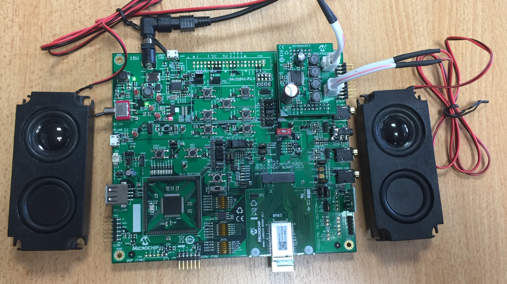

### Evaluate Embedded Mode

<a href="https://ww1.microchip.com/downloads/en/DeviceDoc/BM83-Bluetooth-Audio-Development-Board-User-Guide-DS50002902B.pdf" target="_blank">BM83 Bluetooth Audio Development Board User Guide</a> introduces the kit features, gives you guidelines to setup a quick demo to stream audio using the BM83 module in Embedded mode.
 

**This demo is based on MSPK 2.0 Firmware and requires some customization and some hardware changes. The Embedded Mode has to be selected from the Config Tool. That simply disable BM83 UART.**
**In this mode of operation, the BM83 module is driving the I2S audio output to the STA369BW Audio Daughter Board. The BM83 module is connected to the external codec over I2S and I2C.**
**Follow the instruction from the BM83 Bluetooth Audio Development Board User Guide**
 
Resources: 
- <a href="https://ww1.microchip.com/downloads/en/DeviceDoc/BM83-Bluetooth-Audio-Development-Board-User-Guide-DS50002902B.pdf">BM83 Bluetooth Audio Development Board User Guide</a>
- <a href="https://ww1.microchip.com/downloads/en/DeviceDoc/IS2083_Turnkey_1.2.0.zip" target="_blank">BM83 MSPK2 1.2.0 Software package</a>

Setup of the environment with basic speakers and smartphone: 

 
In below example (video), the BM83-EVB is powered up via a short press on MFB key (blue light) then ready to pair thru long press to the MFB key (blue and red lights toggle). 

## Select the device you need 

Just select the device you need from the following link: <a href="https://www.microchipdirect.com/product/search/all/bm83" target="_blank">Buy BM83</a>
 

Every BM83 modules comes with common feature set: 
Surface mount module with  
Package Size   : 32 x 15 x 2.5 mm 
Lead Count     : 50 
Temp Range     : -20C to +85C 
Op Voltage Min : 3.2V 
Op Voltage Max : 4.2V 

Here the ordering information: 

**BM83SM1-00AA** 
- With RF shield
- Certification : CE, FCC, IC, MIC, KCC, NCC, SRRC
- Class 1 module with +9.5 dBm (EDR) output power
- Multi-Speaker firmware (MSPK) - Version 2.0 (Latest release) - Microchip’s Wireless Concert Technology (WCT)
- Configured in Embedded Mode

## Develop with BM83 

### ... and PIC32MX450F256L in Host mode

<a href="http://ww1.microchip.com/downloads/en/DeviceDoc/BM83_Host_MCU_Firmware_Development_Guide_DS50002896A.pdf" target="_blank">BM83 Host MCU Firmware Development Guide </a> describes the host MCU reference code for Microchip’s Bluetooth® Multi-Speaker solution in Host
mode. It includes demo introductions, hardware connection, UART command set, and source code explanation.

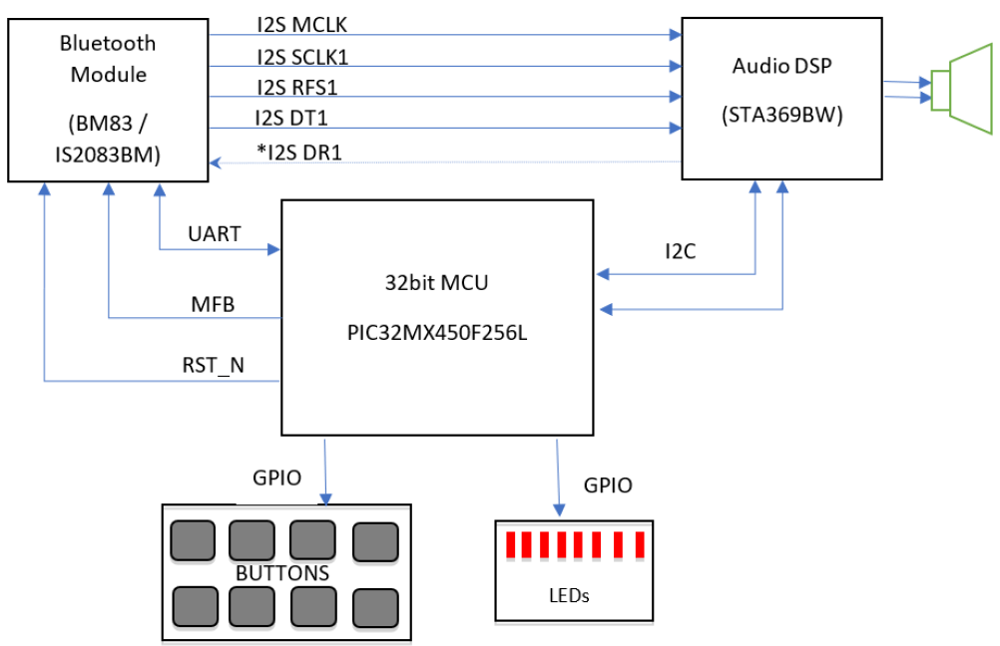

### ... and no external MCU in Embedded mode

## Additional ressources 

### BM83 Firmware Update using a PC 

Follow this video to get started on how to update firmware on BM83 Evaluation board

